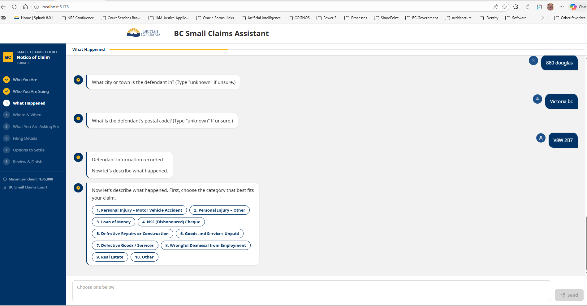

# BC Small Claims Assistant

A two-track prototype for replacing the BC Ministry of Justice's static Filing Assistant with a modern, guided Notice of Claim experience.

---

## Overview

The existing [BC Small Claims Filing Assistant](https://justice.gov.bc.ca/FilingAssistant/) is a static web wizard (Form 1, Version 2.7.5) that walks claimants through a fixed sequence of HTML pages with no intelligence, no adaptability, and no modern UX. This project explores two parallel approaches to replace it.

---

## Prototype 1 — Agentic Plugin (Claude Code / AI Agent)

**Location:** `plugins/small-claims-assistant/`

An intake-to-PDF pipeline driven by an AI agent running inside Claude Code. This prototype demonstrates the full end-to-end pipeline for power users and developer workflows.

### Architecture

```
User (conversational)
    ↓
notice-of-claim-intake-agent   ← guided questioning, adaptive, context-aware
    ↓
canonical case JSON            ← shared contract (notice-of-claim-intake-definition.json)
    ↓
render_notice_of_claim_pdf.py  ← deterministic, no AI, pypdf + reportlab
    ↓
PDF artifact (court-ready)
    ↓
submit_notice_of_claim_mock_api.py  ← mock filing adapter (future CEIS integration)
```

**Key design principle:** AI belongs upstream (intake, guidance, validation). PDF rendering is deterministic — no AI in the render path. The canonical JSON is the contract between the two halves.

### How users should start

Users should start with the intake flow in plain English, not by naming scripts, JSON, or internal files.

Good starting requests are:

- `Help me fill out a BC Small Claims Notice of Claim.`
- `Start a Notice of Claim intake interview.`
- `I want to make a small claims claim in BC. Walk me through the form.`
- `I have some facts already; help me turn them into a Notice of Claim draft.`

The intended flow is:

1. Describe the claim in plain English.
2. Let the intake agent ask for the missing facts in small batches.
3. Confirm the captured facts when the summary is shown.
4. Ask for the next stage only after intake is complete enough.

Typical next-stage requests are:

- `Prepare the draft PDF.`
- `Check whether this is ready for the PDF.`
- `Prepare the filing submission step.`

For a plugin-specific quick guide, see `plugins/small-claims-assistant/START_HERE.md`.

### Components

| Component | Purpose |
|---|---|
| `agents/notice-of-claim-intake-agent.md` | Conversational intake sub-agent — guides questioning, tracks completeness, produces canonical JSON |
| `skills/notice-of-claim-intake/` | Intake skill — Form 1 question order, canonical field mapping, clarification logic |
| `skills/notice-of-claim-pdf-generation/` | PDF generation skill — readiness validation, renderer handoff |
| `skills/notice-of-claim-filing-adapter/` | Mock filing adapter skill — downstream payload transformation |
| `scripts/render_notice_of_claim_pdf.py` | Deterministic PDF renderer — overlays canonical JSON onto official Form 1 template |
| `scripts/write_notice_of_claim_json.py` | Merges partial intake data onto the canonical draft template |
| `scripts/submit_notice_of_claim_mock_api.py` | Emits mock CEIS-style request/response artifacts |
| `assets/templates/forms/small-claims/scl001-notice-of-claim-template.pdf` | Official archived Form 1 template used for rendering |

### Running Tests

```powershell
# Install PDF dependencies
pip install -r plugins/small-claims-assistant/requirements-pdf.txt

# Run all plugin tests
python -m pytest plugins/small-claims-assistant/tests/ -v
```

---

## Prototype 2 — Web App (React / BC Gov Design System)

**Location:** `web/`

A modern browser-based intake assistant built with the official BC Government Design System React component library. This prototype targets end-users directly — no AI required for the happy path.

### Screenshot



### Design Approach

**Default path — zero AI cost:**
The assistant walks the user through the full Form 1 question sequence using pre-canned questions and choice chips. No AI API calls are made during normal use. This mirrors how the original Filing Assistant works, but with a modern conversational UI.

**AI on demand — clarification only:**
If a user asks a question or types something that signals confusion, a static keyword-lookup responds with plain-language guidance. In production, this single call would be routed to Azure Copilot with full context (current step + answers captured so far), giving an intelligent, context-aware response — then returning the user to the intake flow. The handoff point is documented in `web/src/hooks/useIntakeChat.ts`.

This design minimises token consumption: the vast majority of users complete the form without any AI call. AI is a fallback for users who get stuck, not a dependency for every keystroke.

### Form 1 Coverage

The web app covers all screens of the original Filing Assistant:

| Section | Questions covered |
|---|---|
| Who You Are | Individual vs Organisation, full name, street address, city, postal code, phone |
| Who You Are Suing | Individual vs Organisation, full name, address (with "unknown" fallback) |
| What Happened | All 10 official claim categories as choice chips, narrative, written agreement, amount, what went wrong, defendant steps to correct |
| Where & When | City/municipality, date or date range |
| What You Are Asking For | Itemised remedy lines, interest |
| Filing Details | BC court registry location picker (10 registries) |
| Options to Settle | Mediation and settlement conference information |
| Review & Finish | Full summary of captured answers, confirm or edit |

### Running the Web App

**Quickest way — one command from the repo root:**

```powershell
python start_web.py
```

This script will:
1. Check that Node.js is installed
2. Free port 5173 if something else is already using it
3. Run `npm install` automatically if `node_modules` is missing
4. Start the Vite dev server

Then open [http://localhost:5173](http://localhost:5173) in your browser.

**Manual alternative:**

```powershell
cd web
npm install   # only needed once
npm run dev
```

**Requirements:** Python 3.9+ and Node.js 18+ must be on your PATH.

### Tech Stack

| Layer | Technology |
|---|---|
| Framework | React 18 + TypeScript + Vite |
| Component library | `@bcgov/design-system-react-components` v0.7.0 |
| Fonts | `@bcgov/bc-sans` |
| Styling | Custom CSS — BC Gov design tokens (navy `#013366`, gold `#FCBA19`) |
| State | Custom hook (`useIntakeChat`) — no external state library |
| AI | None (static keyword lookup; Azure Copilot seam marked with TODO) |

### AI Integration Seam

The placeholder for production AI is in `web/src/hooks/useIntakeChat.ts`:

```typescript
// TODO: replace findClarification() with an Azure Copilot API call for production.
//   Pass { userMessage, currentStep, currentSection, capturedSoFar } so the model
//   can give a context-aware answer. See PlumbingPoC QuoteAgentModal for the pattern.
const clarification = findClarification(trimmed) ?? FALLBACK_CLARIFICATION
```

---

## Relationship Between the Two Prototypes

Both prototypes share the same canonical Form 1 field model and the same core design principle: intake is guided and potentially AI-assisted; rendering is deterministic and AI-free.

```
Plugin path  →  canonical JSON  →  deterministic PDF renderer
Web app path →  canonical JSON  →  (same renderer, future integration)
```

The web app's intake questions mirror the plugin agent's skill exactly — the same field order, the same clarification responses, the same validation logic. When the web app eventually calls an AI API for clarification, it will be calling the same kind of agent that the plugin path already uses end-to-end.

---

## Repository Structure

```
small-claims-assistant/
├── plugins/
│   └── small-claims-assistant/     ← Agentic plugin prototype
│       ├── agents/
│       ├── skills/
│       ├── scripts/
│       ├── assets/
│       └── tests/
├── web/                             ← React web app prototype
│   └── src/
│       ├── components/
│       ├── data/
│       ├── hooks/
│       └── types/
├── exploration/                     ← Discovery notes and session briefs
├── outputs/                         ← Rendered PDF artifacts from test runs
├── docs/
│   └── screenshots/
└── CLAUDE.md                        ← AI agent working instructions
```

---

## Status

**Both prototypes are proof-of-concept only. Neither is production-ready.**

### Python PDF Renderer — POC, not QA'd

`plugins/small-claims-assistant/scripts/render_notice_of_claim_pdf.py` has not been through any quality assurance. Known limitations and areas requiring further work before it could be considered production-ready:

- **Field alignment** — coordinate-based overlays (`reportlab` + `pypdf`) have not been verified against the official Form 1 template at all zoom levels and print sizes. Fields may be misaligned on different PDF viewers or printers.
- **Multi-page overflow** — no handling for narrative or remedy text that exceeds the space available on a single page.
- **Character encoding** — special characters, accented letters, and legal symbols have not been tested.
- **All claim categories** — only the "Defective Goods / Services" path has been exercised. The 9 other claim categories have category-specific fields that are not yet rendered.
- **Multiple claimants / defendants** — the renderer handles one claimant and one defendant. The form supports multiple parties; that logic is not implemented.
- **Validation gaps** — the readiness check catches missing required fields but does not validate formats (postal codes, dates, dollar amounts).
- **Print-ready output** — no testing against court registry submission standards (PDF/A compliance, font embedding, etc.).

This renderer demonstrates the architecture (canonical JSON → deterministic PDF overlay) but would require significant iteration, field-by-field QA against the official form, and testing across representative case scenarios before producing court-ready documents.

### Web App

Functional end-to-end as a guided intake prototype. No AI API is connected — the clarification path uses a static keyword lookup (zero token cost). The Azure Copilot seam is marked with a TODO comment for future wiring.

### Next Steps

- QA and iterate the PDF renderer field-by-field against the official Form 1 template
- Connect web app clarification path to Azure Copilot API
- Bind web app collected answers to the canonical JSON writer script
- Wire canonical JSON through to the PDF renderer from the web path
- Add save/restore (session persistence)
- Accessibility audit against WCAG 2.1 AA
- Test across all 10 claim categories end-to-end
