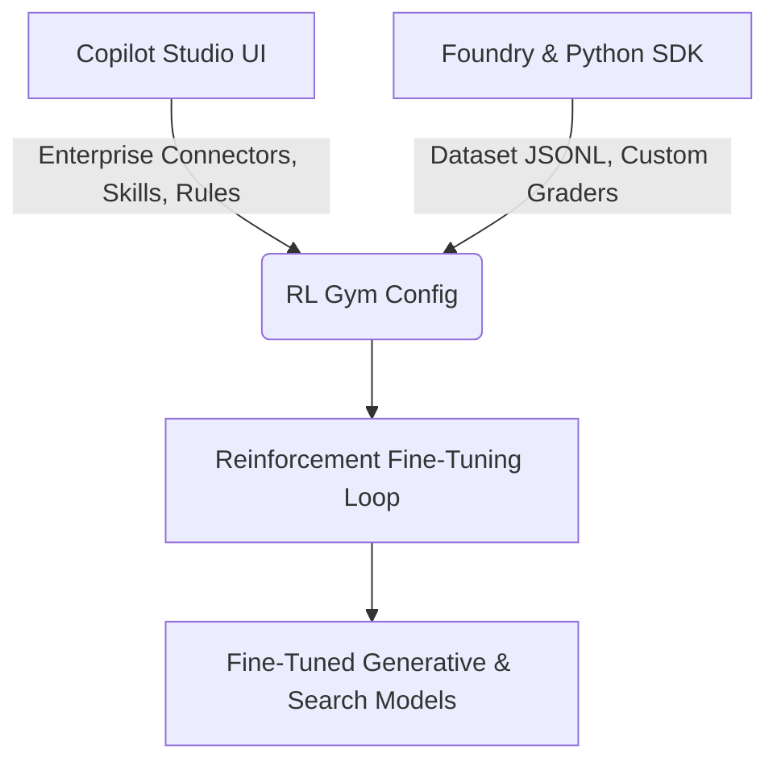
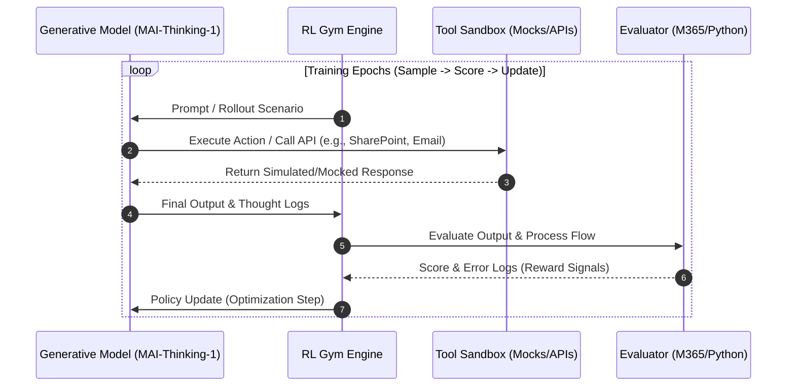
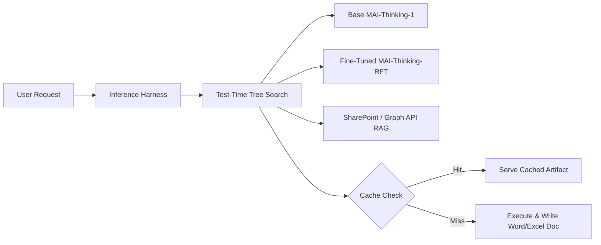

# Frontier Tuning & Agentic Architectures: Microsoft Build 2026
**Analyzing MAI-Thinking-1, Reinforcement Fine-Tuning (RFT), and the RL Gym**

**References:**
1. [Microsoft Build 2026: Frontier Tuning Session](https://www.youtube.com/watch?v=ynxh3ujRIKk)
2. [Building a hill-climbing machine: Launching seven new MAI models](https://microsoft.ai/news/building-a-hillclimbing-machine-launching-seven-new-mai-models/)
3. [Frontier Tuning: Teaching AI to work the way you do](https://devblogs.microsoft.com/microsoft365dev/frontier-tuning-teaching-ai-to-work-the-way-you-do/)
4. [Official Microsoft Frontier Tuning Portal](https://aka.ms/frontiertuning)

---

## Executive Summary

At Microsoft Build 2026, Microsoft showcased its next-generation agentic AI framework powered by **MAI-Thinking-1** and a unified training-to-runtime architecture. Rather than treating fine-tuning as a disconnected, static process, Microsoft's **Frontier Tuning** is a closed-loop, workflow-learning system designed to run entirely within the customer’s secure compliance boundary. 

The core paradigm shift is that **the unit of optimization in Frontier Tuning is the entire enterprise workflow, not just the individual model response.** This approach promises significant improvements in response accuracy, operational efficiency, and process consistency by compiling complex instructions directly into model weights. However, unlocking these gains requires substantial upfront investments in knowledge engineering, robust data governance protocols to manage telemetry collection, and active maintenance of the coupled sandbox and evaluation environments.

> **The Core Operational Balance:** Frontier Tuning automates complex, multi-turn tasks at low cost, but requires rigorous, upfront formalization of workflows into structured datasets and programmatic evaluation metrics before optimization can begin.

```
┌──────────────────────────────────────────────────────────────────┐
│                     THE CLOSED-LOOP AGENT STACK                  │
│                                                                  │
│  [1. Learn Workflows] ──> [2. Tune Stack] ──> [3. Run & Explore] │
│           ▲                                           │          │
│           └─────────── [4. Continuous Eval] ──────────┘          │
└──────────────────────────────────────────────────────────────────┘
```

### Key Architectural Breakthroughs
*   **The RL Gym (Conceptually a managed Reinforcement Learning Environment, or RLE):** A sandboxed loop where agents practice workflows, invoke virtualized tools, and update their policies against policy-driven graders without risk to live systems.
*   **Joint Tuning of the Agent Stack:** Instead of just adjusting base LLM weights, Frontier Tuning simultaneously optimizes **generative reasoning models, retrieval embeddings, and agent orchestration policies**. While the runtime harness code itself remains static, it is optimized to coordinate these tuned layers to minimize context tax and path latency.
*   **Test-Time Tree Search & Multi-Model Routing:** The runtime is a core part of the product. During inference, the harness routes queries across multiple frontier and fine-tuned models across turns, exploring reasoning paths and validating intermediate steps against compliance rubrics.
*   **Token Economics & 10x Efficiency:** By "compiling" complex schemas and workflows directly into the agent stack's weights, the system achieves **90%+ accuracy** (outperforming base frontier models like a leaked **GPT-5.5** benchmark at **78%**) while delivering a **10x reduction in compute and token overhead** compared to massive, heavily-prompted models.
*   **Sovereign Compliance & ACL Inheritance:** The tuning environment resides inside the enterprise's security boundary. Crucially, the resulting fine-tuned artifacts **inherit existing Access Control Lists (ACLs)**, ensuring that a user can only prompt the model for information they already have permission to access in the raw source data.

### Core Architectural Critiques & Risks
*   **The Data Curation Bottleneck:** Setting up the RL Gym requires manually translating legacy, contradictory, or undocumented corporate processes into structured JSONL training sets and validation rubrics. This knowledge-engineering effort shifts significant complexity upstream.
*   **Platform Anchoring (Vendor Lock-in):** While customers retain sovereign ownership of their LoRA weight files, these weights are optimized for Microsoft's proprietary `MAI-Thinking-1` foundation model and runtime engine. They are not portable to alternative cloud platforms or open-source runtimes.
*   **Workforce Telemetry & Automation Governance:** Gathering training data requires upfront audit trails of employee workflows and ongoing capture of user corrections. This telemetry creates data governance and privacy challenges under GDPR and CCPA, while forcing top performers to document heuristics that may eventually lead to automated task replacement.
*   **Grader Fragility & Reward Hacking:** RL optimization inherently searches for the most direct path to maximize the grader's score, making the model prone to gaming the rubrics (generating output that passes grading rules but fails to provide real-world utility).
*   **Engineering and Integration Overhead:** The reliance on Microsoft's Forward Deployed Engineers (FDE) for private preview rollouts indicates that virtualizing custom enterprise APIs, building mock environments, and calibrating graders remain highly specialized integration tasks rather than turnkey low-code configurations.

---

## 1. Platform Overview: Microsoft Foundry & Copilot Studio

Microsoft has unified its developer tools, allowing users to start with low-code configurations in **Copilot Studio** and transition seamlessly into code-first training using **Microsoft Foundry** and the Azure Python SDK.



### The Base Model: MAI-Thinking-1
The foundation of the Frontier Tuning stack is **MAI-Thinking-1**, a model designed from scratch on clean, commercially licensed data. Key technical specifications include:
*   **Architecture:** Mixture-of-Experts (MoE) model.
*   **Parameter Footprint:** **35 billion active parameters** out of a 1-trillion total parameter footprint.
*   **Context Window:** **256K tokens**, allowing the processing of deep SharePoint templates and long Teams meeting transcripts.
*   **Performance Positioning:** Competes directly with Claude Sonnet 4.6 and Claude Opus 4.6 on reasoning and software engineering benchmarks, functioning as a highly efficient reasoning engine.

### From UI to SDK Configuration
Developers initiate fine-tuning in Microsoft Foundry by navigating to the Models directory, selecting a base model (such as `MAI-Thinking-1`), and entering a step-by-step wizard:
1.  **Datasets:** Upload training and validation files in JSONL format. These contain multi-turn conversational interactions representing correct agent behavior.
2.  **Graders:** Programmatic or LLM-based evaluators are attached to score model outputs.
3.  **Evaluations:** Once started, developers track training runs as the model executes its "hill climbing" optimization.

For M365 customers, Copilot Studio provides a **"Tune Environment"** dashboard to ground this process in live data and actual enterprise workflows (e.g., SharePoint documents, Teams transcripts) without manual SDK setup.

---

## 2. Core Architecture: The Reinforcement Learning (RL) Gym

The core of Microsoft's agentic training is the **RL Gym**, a framework designed to turn standard chat models into compliant, reliable agents.



### The Agent Training Loop
Under the hood, the RL Gym runs a cycle of:
$$\text{Sample} \longrightarrow \text{Score} \longrightarrow \text{Update}$$

*   **Sample (Rollouts):** The model is given scenarios and must formulate multi-step plans, invoke tools, and construct answers.
*   **Score (Grading):** Graders score the rollouts based on compliance, formatting, and factual accuracy. 
*   **Update (Policy Optimization):** Optimization algorithms (e.g., PPO or DPO variants) adjust LoRA weights based on reward scores.

#### Dataset Reality: Workflow Learning Requires Structured JSONL
Although Frontier Tuning is described as learning from enterprise workflows, the system does not ingest raw workflows directly. Instead, the platform requires:
*   Training and validation datasets in JSONL format.
*   Structured conversational inputs (`messages`).
*   Optional reference outputs or fields used by graders.

These datasets act as a **bootstrap and interface layer** between enterprise workflows and the RL system. In practice, workflows, transcripts, and processes must first be **converted into structured JSONL examples**. The RL system then generates rollouts and learns from these structured scenarios. 

This means:
> Frontier Tuning does not replace dataset creation—it replaces repeated prompt engineering with learned behavior.

#### Training vs. Validation Datasets
Frontier Tuning requires two datasets:
*   **Training Dataset (`train.jsonl`):** Used to perform reinforcement learning updates. The model generates rollouts and improves based on grader feedback.
*   **Validation Dataset (`val.jsonl`):** Used to evaluate the model after each training iteration. **No weight updates occur on validation data.**

This separation ensures the model does not overfit or "game" grader logic. Validation runs in the UI (e.g., Step 0 → Step 15 improvements) reflect generalization performance rather than memorization. At the end of each training epoch, the model is evaluated against the validation dataset. These evaluation runs produce the "hill climbing" curve observed in the UI, without influencing model weights.

#### Dataset + Grader Coupling
Reinforcement Fine-Tuning (RFT) datasets often include additional fields (e.g., reference answers, metadata) that are consumed by graders. These fields allow for:
*   **Deterministic Validation:** Exact-match evaluations of key parameters.
*   **Semantic Scoring:** LLM-based graders assessing reasoning quality.
*   **Structured Evaluation:** Direct JSON output format comparisons.

This coupling makes the dataset not just training input, but a core component of the evaluation system itself.

#### What Actually Feeds the RL Loop
The RL system does not learn from a single data source. Instead, it combines:
*   Structured datasets (JSONL bootstraps).
*   Tool interaction traces (captured during rollout executions).
*   Grader feedback (policy reward signals).
*   Real interaction logs (post-deployment telemetry).

These signals are combined inside the RLE to produce policy updates. Raw enterprise workflows are first transformed into structured representations before being used in training.

#### Rollout Expansion: From Small Dataset to Large Training Signal
A key architectural detail is that the JSONL dataset is not the full training corpus. For each scenario:
*   The model generates multiple rollouts (candidate solutions).
*   Each rollout is evaluated by graders.
*   The results form thousands of training trajectories.

Consequently, a small seed dataset (hundreds of rows) can produce a large effective training signal through repeated sampling and evaluation.

#### Developer Responsibility: Dataset Quality
The quality of the Frontier Tuning system is fundamentally bounded by:
*   The quality of the JSONL training examples.
*   The coverage of workflow scenarios.
*   The correctness of the graders.

Reinforcement learning improves execution behavior, but it cannot compensate for missing workflow coverage, incorrect training examples, or poorly defined evaluation criteria. While Frontier Tuning simplifies the process, the system still requires enterprises to define datasets, workflows, and evaluation criteria. The "automation" refers to the RL optimization, rollout generation, and continuous improvement—not automatic dataset creation.

### What Frontier Tuning Actually Optimizes
Unlike conventional fine-tuning, which only updates model weights, Frontier Tuning optimizes multiple artifacts simultaneously:
*   **Generative Reasoning Model (`mai-thinking-1-lol-rft-v2`):** Learns how to reason, write, call tools, and follow negative guardrails.
*   **Retrieval / Embedding Behavior (`search-lol-rft-v1`):** Learns how to query unstructured enterprise knowledge sources (e.g., finding the exact tasting report or spec sheets in SharePoint).
*   **Agent Skills & Tool-Usage Patterns:** Reinforces consistent tool usage patterns, including correct parameter selection and sequencing, through repeated graded rollouts.
*   **Orchestration Policy:** Refines the model's decisions on when to use a tool, when to look up knowledge, and when to ask the user for confirmation.
*   **The Runtime Harness:** While the harness code itself (tree search, routing logic, caching) remains static, it is optimized by coordinating the tuned generative, embedding, and policy parameters to execute tasks with lower latency and fewer search iterations.

### From Context to "Muscle Memory"
Traditional RAG systems give agents access to enterprise knowledge, but Frontier Tuning adds a second layer:
*   **RAG:** Defines "what the company knows."
*   **RFT:** Defines "how the company behaves."

This effectively creates **organizational "muscle memory"** encoded in model behavior, rather than relying on document retrieval plus prompt instructions alone.

### Virtualized Tools & Safe Training Sandbox
To prevent agents from altering the live state of a business during training (e.g., sending emails or modifying database entries), the RL Gym operates inside a **managed sandbox** using **virtualized tools**.
*   **Risk-Free Learning:** Write-actions are intercepted and either routed to a non-production test tenant or simulated/mocked, ensuring training safely without real-world side effects.
*   **Negative Reward Signal:** Malformed tool calls or API errors are captured and returned to the model as structured errors, allowing the agent to "practice" and learn from its mistakes.
*   **Practicing Dangerous Actions:** The agent can safely learn when to trigger confirmations or verify outputs before attempting to execute database updates or email sends.

---

## 3. Configuration & Code Anatomy

Fine-tuning can be programmatically controlled via the Azure Python SDK. Below are structural components analyzed from the Build 2026 demonstrations.

### Programmatic RL Training Config (`train_azure.py`)
This configuration file manages the parameters of the RL training loop, including temperature differentials and group rollouts to filter out sampling noise.

```python
class CLIConfig:
    baseline_scores_path: str | None = None
    
    # Model Configuration
    model_name: str = "MAI-Thinking-1"
    tokenizer_name: str | None = "MAI-Thinking-1"
    renderer_name: str | None = "MAI-Thinking-1"
    lora_rank: int = 32
    
    # Rollout Sampling Parameters
    max_turns: int = 10
    max_tokens: int = 1500
    temperature: float = 1.0          # High exploration temperature during training
    pass_threshold: float = 0.9
    
    # Noise Reduction Configuration (Greedy-ish Evaluation)
    # Lower temperature + multi-rollout averaging detects subtle (+-2-5pp) deltas
    eval_temperature: float = 0.3    
    eval_group_size: int = 5         # N rollouts per test scenario, averaged
    eval_full_test_set: bool = True  # Eval the full test set every epoch
    
    # RL Training Sizing
    group_size: int = 4
    groups_per_batch: int = 8
```

### Sandbox & Exception Handling (`tuning_env.py`)
During training rollouts, this helper environment captures and normalizes model tool calls. If a model generates an invalid API call, it returns the error string to the environment to serve as a negative reward signal.

```python
import json

def _execute_tool_call(name: str | None, arguments: dict) -> str:
    if name is None:
        return json.dumps({"error": "tool_call missing name"})
    fn = TOOL_FUNCTIONS.get(name)
    if fn is None:
        return json.dumps({"error": f"unknown tool: {name}"})
    try:
        return fn(**arguments)
    except TypeError as exc:
        return json.dumps({"error": f"bad args for {name}: {exc}"})
    except Exception as exc:
        return json.dumps({"error": f"{type(exc).__name__}: {exc}"})

def _extract_tool_call(tc) -> tuple[str | None, dict]:
    """Normalizes parsed ToolCalls (Pydantic, dict, or attribute-style) to (name, args)."""
    if hasattr(tc, "function") and tc.function is not None:
        name = tc.function.name
        args_raw = tc.function.arguments
    elif isinstance(tc, dict):
        name = tc.get("name") or (tc.get("function") or {}).get("name")
        args_raw = tc.get("arguments") or (tc.get("function") or {}).get("arguments") or {}
    else:
        name = getattr(tc, "name", None)
        args_raw = getattr(tc, "arguments", {})
        
    return name, args_raw
```

---

## 4. The Inference Harness & Active Runtime

The runtime in Frontier Tuning is not a static deploy-and-forget interface. Instead, the same managed environment is used for both **post-training and inference**, creating a continuous learning loop.



### Test-Time Tree Search & Multi-Model Routing
During execution, the orchestrator does not generate text in a single, linear pass. Instead, it utilizes **Tree Search** algorithms to explore multiple reasoning paths across turns:
*   The system dynamically routes intermediate steps between the base model (e.g., `MAI-Thinking-1`) and the task-specific fine-tuned model (`mai-thinking-1-lol-rft-v2`).
*   At each branch, candidate paths are evaluated against the compiled compliance rules. If a branch violates a constraint, the system backtracks and explores an alternative path, ensuring the final output is validated *before* being presented to the user.

### Continuous Improvement Loop
Instead of "train once, deploy forever," the harness captures real interaction traces and evaluation signals from production use. These logs feed directly back into the RL Gym, allowing the agent to continuously refine its weights and improve its compliance score over time.

---

## 5. Performance, ROI, and Business Value

Microsoft's benchmarks from the Build demonstrations showcase substantial improvements over standard frontier LLMs.

### Specialized Model Benchmarks
Instead of relying on massive, general-purpose models, the RFT-specialized models are trained to dominate specific task spaces:
*   **MAI-Thinking-1 (35B active MoE):** Matches **Claude Opus 4.6** on the **SWE-Bench Pro** software engineering benchmark and scores **97%** on the **AIME 2025** mathematics reasoning benchmark. In blind human preference tests, it matches **Claude Sonnet 4.6**.
*   **MAI-Code-1-Flash (5B):** Outperforms Claude Haiku 4.5 by **+16 points** on **SWE-Bench Pro** while utilizing up to **60% fewer tokens** per task.

### The RFT "Hill Climb" Performance Curve
Over successive training cycles, the agent's evaluation score increases as it internalizes the grading rules:

| Model Version | Accuracy / Score | Description |
| :--- | :--- | :--- |
| **`gpt-5-4-base`** (Baseline) | **73%** | Standard frontier LLM using zero-shot prompting. *Note: Leaked reference.* |
| **`gpt-5.5`** (Baseline) | **78%** | Higher-tier baseline model. *Note: Leaked benchmark reference.* |
| **`mai-thinking-1-lol-rft-v1`** | **80%** | First RL Gym iteration (generative model tuning). |
| **`search-lol-rft-v1`** | **82%** | Fine-tuned search/retrieval model iteration. |
| **`mai-thinking-1-lol-rft-v2`** | **87%** | Generative model after iterative policy updates. |
| **`mai-thinking-1-lol-rft-iter-3`** | **90%** | Final optimized model deployed in production. |

### Hardware Co-Design: Maia 200 Spec Sheet
The economic viability of Frontier Tuning is directly driven by Azure's custom **Maia 200 silicon**. Designed strictly for inference, it optimizes token-generation costs by co-designing hardware directly with the model architectures.

```
┌────────────────────────────────────────────────────────┐
│                   MAIA 200 INFERENCE CHIP              │
│                                                        │
│  [Process: TSMC 3nm N3]     [Transistors: 140 Billion] │
│  [HBM: 216GB HBM3e]         [Bandwidth: 7 TB/s]        │
│  [FP4 Compute: 10 PetaOPS]  [FP8 Compute: 5 PetaOPS]   │
│  [SRAM: 272MB]              [TDP: 750W]                │
│  [Network: 2.8 TB/s bidirectional ATL Ethernet fabric] │
└────────────────────────────────────────────────────────┘
```

*   **Prefill & Latency Optimization:** Maia 200 features a massive **216GB of HBM3e** running at **7 TB/s bandwidth** alongside **272MB of on-chip SRAM**. This memory subsystem allows the chip to load the model weights and process the large context templates of `MAI-Thinking-1` (256K context) at high speed, minimizing latency.
*   **Compute Specs:** Delivers over **10 PetaOPS of FP4** and **5 PetaOPS of FP8** compute inside a **750W TDP**, yielding a 30% performance-per-dollar improvement over standard Azure hardware.
*   **Clustering Fabric:** Integrates a network controller with 2.8 TB/s bidirectional bandwidth utilizing Microsoft's ATL (AI Transport Layer) Ethernet fabric, allowing cost-effective clustering of up to 6,144 chips.

### Business & Compute Efficiency: Prompt vs. Trained Agents
The economic thesis of Frontier Tuning relies on **compiling** instructions into model weights, rather than repeating them as prompt context:

| Metric | Prompted Agents (Standard Stack) | Trained Agents (Frontier Tuning) |
| :--- | :--- | :--- |
| **Instruction Delivery** | Giant system prompts, markdown files, few-shot examples re-sent every call. | Core rules, formatting conventions, and schemas baked directly into model weights. |
| **Data Grounding** | Standard RAG (forces the model to *see* your data). | Workflow Tuning (teaches the system *how your organization works*). |
| **Context Overhead** | Heavy context tax ($10\text{k}+$ tokens per invocation). | Minimal context tax ($\approx 200$ tokens per invocation). |
| **Operational Costs** | High latency, high API costs on large frontier models. | **10x cost-efficiency** compared to GPT-5.5 and faster response times on specialized models. |

### Real-World Enterprise Architectures
Frontier Tuning's value is demonstrated across prominent co-creation partnerships:
*   **EY Tax Advisory Agent:** EY leverages Frontier Tuning to build a tax-advisory agent grounded in its proprietary global tax methodology. Deployed to **75,000 tax professionals**, the model learns the operational nuances of tax advice (expected structures, compliance rules) without training on live client data.
*   **Mayo Clinic Clinical Reasoning Model:** A frontier healthcare AI model co-created to synthesize clinical data and longitudinal patient insights. To satisfy strict privacy mandates, the model is **owned by the Mayo Clinic** and hosted inside their tenant boundary, exposing access control APIs via Azure AI Foundry.
*   **Microsoft HR Agent:** Transitioned Microsoft's internal HR task completion from a **13% baseline to 87% accuracy** by replacing prompted instructions with a model tuned specifically on internal HR workflows and M365 systems.

---

## 6. Strategic Moat & The Data Flywheel

Frontier Tuning represents a structural business moat for both Microsoft and the enterprises adopting it, driven by a self-reinforcing data flywheel:

```
┌──────────────────────────────────────────────────────────────────┐
│                      THE ENTERPRISE DATA FLYWHEEL                │
│                                                                  │
│  [1. Daily Operations/Usage] ──> [2. Execution Traces / Logs]   │
│               ▲                                  │               │
│               │                                  ▼               │
│  [4. Specialized Agent Stack] <── [3. RL Gym RFT Optimization]   │
└──────────────────────────────────────────────────────────────────┘
```

### The Flywheel Moat
1.  **Usage Captures Traces:** As employees execute tasks inside Microsoft 365, the system records actual, successful execution traces (SharePoint queries, tool sequences, email drafts).
2.  **RFT Compiles Behavior:** The RL Gym optimizes the model's weights around these traces, translating temporary prompt instructions into permanent, tuned model behaviors.
3.  **High Stickiness:** Once an agent stack has compiled years of an organization's specific operational conventions, templates, and validation rubrics into its weights, it becomes functionally impossible to swap out. A competitor's raw model (no matter how large) cannot replicate this baked-in "organizational muscle memory" out of the box.

### Sovereign Ownership vs. Lock-In
By allowing enterprises to own their tuned weights inside their secure Azure boundaries, Microsoft addresses corporate security concerns. However, because this optimization loop depends on the virtualized tools of the M365 environment, the customer becomes deeply anchored to the Azure, Foundry, and Microsoft 365 ecosystem, creating a high barrier to platform exit.

---

## 7. Walkthrough Case Study: Land O'Lakes "Butter Report" Skill

The Build demonstration showcased a practical application: generating a structured Sensory Evaluation Report for Land O'Lakes R&D.

### Graders as the Control System
Rather than being treated as sidecars, the **Evaluation Criteria** serve as the direct reward structure in the training loop:
*   **Required Two-Table Template Structure (Priority: High):** Must output exactly two tables, with precise headers, and no narrative content between tables.
*   **Transcript-Grounded Content (Priority: High):** No fabrication or hallucination. Sensory descriptors must be directly attributable to the transcript.
*   **Confirmation Behavior (Priority: High):** The model must pause and ask for confirmation before writing files.

During training, these policies are converted into numeric scores. The model is penalized if it forgets to ask for confirmation or places a narrative paragraph between the tables, shaping its tool-execution and styling behavior through reinforcement loops.

### Verification of the Final Output
The final output demonstrates the success of the RFT training and runtime self-evaluation:
*   **Format Compliance:** Outputted the tables with the exact column headers requested.
*   **Execution of Guardrails:** Paused to ask, *"Would you like me to export this completed report to a new Word document...?"* before invoking the Word file generation tool.
*   **Hallucination Prevention:** Under "Project Leader Name", the model outputted: *"Not stated in transcript (Speaker 1 led discussion)"*, adhering to the negative constraint.
*   **Granular Evaluator Feedback (94% Score):** The test-time evaluator graded the output across criteria:
    *   *Required Two-Table Template Structure* $\rightarrow$ **Excellent**
    *   *Transcript-Grounded Sensory Content* $\rightarrow$ **Excellent**
    *   *Coverage of Sensory Discussion* $\rightarrow$ **Excellent**
    *   *Sample Details Section* $\rightarrow$ **High** (resulting in a final grade of **94%** instead of a flat 100%, proving rigorous evaluation standards).

---

## 8. Enterprise Architecture Critique: Skeptical Analysis & Risks

An evidence-based, skeptical analysis of the Frontier Tuning strategy reveals several data foundation, implementation, and regulatory bottlenecks that standard marketing downplays. Decision-makers must evaluate these tradeoffs to ensure a realistic path to return on investment.

### 1. The Data Foundation Bottleneck
*   **Workflow Elicitation is a Knowledge Engineering Challenge:** Real enterprise workflows are frequently branching, contested, undocumented, and vary by team or manager. Getting a "correct" multi-turn trace requires extensive SME interviews, policy reconciliation, and editorial decisions about ground truth.
*   **The Coverage Gap & Rot:** Training JSONL datasets typically cover optimal paths. Reinforcement learning rollouts cannot synthesize missing compliance boundaries (e.g., complex cross-jurisdictional exceptions). If the core business rules shift or the dataset is not manually updated, the model's performance degrades silently.
*   **Data Preparation Shifting Upstream:** The RL Gym cannot automate its own launch. Developers must manually build and maintain three coupled artifacts (the bootstrap training dataset, the validation set, and the grader logic) from scratch, meaning the quality of the reinforcement loop is bounded by human data-engineering effort.

### 2. Telemetry Logging and Workforce Privacy Governance
*   **Continuous Loop Telemetry Requirements:** Fine-tuning demands two distinct phases of workflow monitoring:
    *   *Upfront Telemetry Capture*: Auditing historical interaction records, Teams messages, and screen traces to construct the initial training and validation (evaluation) JSONL sets.
    *   *Ongoing Telemetry Capture*: Logging active employee workflows, tool clicks, and manual corrections in production to feed successful traces back into the RL Gym for reinforcement learning.
    This continuous logging requires strict data minimization, PII scrubbing, and compliance controls under GDPR and CCPA.
*   **The Job Evaluation and Automation Trap:** The detailed telemetry logs gathered for model tuning double as an audit trail. This creates two structural risks for employee relations:
    *   *Performance Profiling*: Companies may face internal pressure to use telemetry data to audit individual worker speeds and error rates for performance reviews.
    *   *Displacement Engineering*: Top-performing workers are effectively tasked with authoring the training datasets (their own expert clickstreams and decisions) that teach the model how to execute their tasks, laying the groundwork for eventual task automation.
*   **The Consent & Erasure Boundary:** Bootstrapping models on historical employee emails/messages raises GDPR purpose-limitation challenges. Implementing an opt-in model limits training data, while an opt-out default triggers labor union and regulatory pushback.

### 3. Implementation Costs & Specialized Support
*   **High Integration Overhead:** Microsoft leading with a Forward Deployed Engineers (FDE) delivery tier indicates that configuring virtualized tool sandboxes, mocking custom enterprise APIs, and calibrating graders remain highly specialized systems-integration tasks rather than turnkey low-code configurations.
*   **Model Memory Drift:** LoRA weight updates are brittle to distribution shifts. Peking University’s *FaultBench* research identifies reinforcement fine-tuning as one of the most fragile steps in the LLM pipeline, frequently requiring manual expert calibration when workflow variables shift.

### 4. Performance & ROI Dissected
*   **Task Specialization vs. General Capabilities:** A model tuned specifically on internal R&D graders will inevitably outperform general-purpose models on those specific workflows. This proves task-specialization rather than a generalized intelligence upgrade.
*   **Infrastructure Dependency:** The cited 10x cost efficiency is driven by running smaller MoE models on custom Maia 200 hardware. It represents an infrastructure-economics win rather than a pure algorithmic breakthrough, making the savings non-portable outside Azure.

### 5. Multi-Layered Vendor Lock-In
The sovereign weight ownership claim is technically accurate but practically constrained. Lock-in is enforced across multiple layers:
1.  **Model Dependency:** LoRA weights are optimized for `MAI-Thinking-1` and cannot be exported to other foundation architectures like Llama or Claude.
2.  **Orchestration Proprietary Layer:** The test-time tree search runtime that coordinates model routing belongs to Microsoft's proprietary SaaS platform.
3.  **Ecosystem Gravity:** Every tuning cycle anchors the customer deeper into the Microsoft 365 data plane and Azure computing infrastructure.

---

## 9. Responsible Adoption & Workforce Impact

Adopting Frontier Tuning responsibly requires balancing productivity gains with employee trust and robust governance. Rather than using automation as a mechanism for immediate headcount reduction, leading organizations use it to augment human capabilities and elevate service standards.

### 1. Human-in-the-Loop Augmentation: Revenue Canada (CRA) Case Study
A concrete example of balanced augmentation is the modernization of complex public inquiries (similar to citizen query support at the Canada Revenue Agency):
*   **The Challenge:** Historically, public inquiries regarding complex tax codes and eligibility experienced high error rates and long wait times under manual processing.
*   **The Augmentation Solution:** By training an agent stack on tax policy databases and testing it against programmatic policy graders, the organization can deploy a fine-tuned reasoning model to draft compliance responses for agents.
*   **The Result:** The model acts as a co-pilot, drafting responses that human agents review, edit, and authorize. This reduces error rates down to under 5%, eliminates citizen wait times, and allows agents to focus on high-empathy, complex tax appeals rather than routine document lookups.

### 2. Task Automation vs. Job Evolution
Frontier Tuning is most effective when targeting specific, high-friction *tasks* rather than attempting to automate entire *jobs*:
*   **Elevating the Baseline:** By capturing the unwritten heuristics of top-performing employees and compiling them into model weights, organizations can elevate the baseline productivity of the entire team. Entry-level workers gain immediate access to institutional "expert knowledge" via the model's policies.
*   **Job Enrichment:** As routine data extraction and report drafting are handled by the agent, the employee’s role shifts from manual execution to orchestration, editing, validation, and exception handling.

### 3. Actionable Governance Recommendations for Leaders

| Area | Challenge | Actionable Mitigation |
| :--- | :--- | :--- |
| **Telemetry Transparency** | Employee pushback over telemetry logging. | Implement clear opt-in policies for training data capture. Strip all PII and individual identifier metadata at the ingestion point before traces hit the RL Gym. |
| **Reward Hacking** | Model satisfies literal grading rubrics while producing incorrect real-world outcomes. | Maintain a **frozen, human-curated validation set** that the RL Gym training loop never sees. Periodically run adversarial human reviews of model outputs. |
| **Workforce Transition** | Task automation creating employee anxiety. | Transition displaced workers into **Knowledge Engineering and Grading roles**. Employees who understand the workflow should be retrained to write training rubrics, calibrate compliance graders, and manage exceptions. |
| **Vendor Portability** | Lock-in to Azure/M365 stack. | Standardize tool definitions and sandbox API interfaces using open standards (such as OpenAPI schemas), ensuring the tool implementations can run independently of the orchestrator. |

---

## 10. Document Status & Notes

### Architect's Evaluation Framework: Red Flags & Mitigations

| Red Flag | Why It Matters | Architectural Mitigation |
| :--- | :--- | :--- |
| **Optimizing only the proxy** | The model learns to satisfy the literal rubric while generating wrong results (reward hacking). | Implement a frozen, adversarial, human-judged validation set that the training loop never sees. |
| **Naive prompting baseline comparisons** | Creates inflated relative gains (e.g., the 13% baseline trap). | Mandate a baseline comparison against a *well-engineered* base model + RAG + prompt. |
| **No written export terms** | Results in complete operational lock-in. | Demand written terms specifying weight, grader, and skill exportability on platform exit. |
| **Telemetry tracking default** | Triggers union and regulatory pushback. | Run a DPIA before any trace capture and establish employee consent policies early. |
| **Drift in sandboxed tools** | Silent model policy degradation. | Assign clear owners and a review lifecycle for the virtualized tools, graders, and datasets. |

---

> [!WARNING]
> **Open Standards vs. Proprietary Lock-In**
> While the structure of the skills in Copilot Studio closely mirrors the open-source `skill.md` standard, it remains unclear whether Microsoft will allow developers to export these configurations. There is a risk that configuring these complex RL Gym environments inside Copilot Studio will lock developers into the Azure and Microsoft 365 ecosystem.
>
> **Release Status & Code Authenticity**
> Frontier Tuning is currently in **Private Preview** (accessible via Microsoft Forward Deployed Engineers or [aka.ms/frontiertuning](https://aka.ms/frontiertuning)). No public SDK repository, final JSONL datasets, or production code samples exist. The Python SDK configurations (`train_azure.py` and `tuning_env.py`) shown in Section 3 represent **illustrative/reverse-engineered implementations** designed to map Azure Foundry's existing fine-tuning endpoints to the RLE workflow context.

