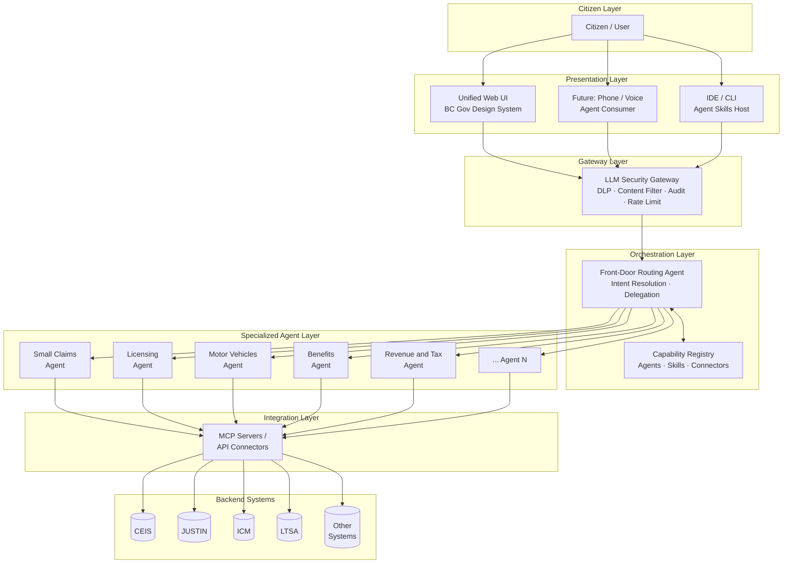
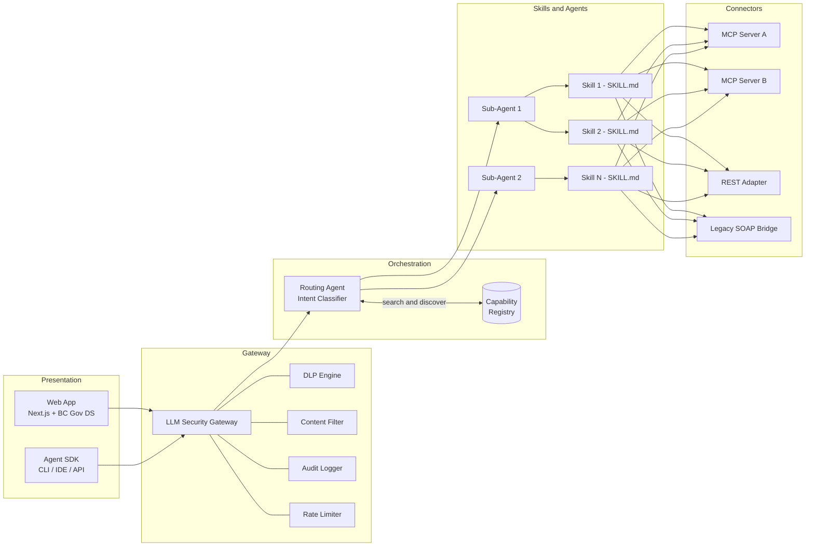
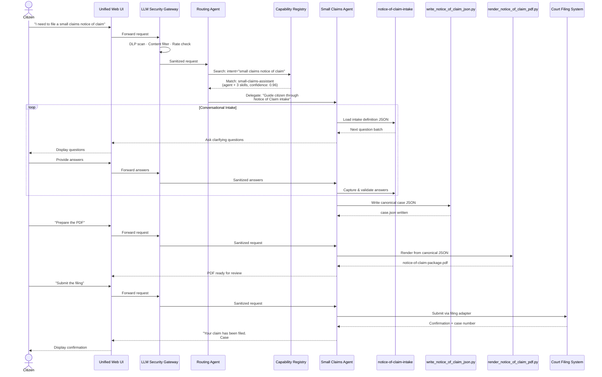
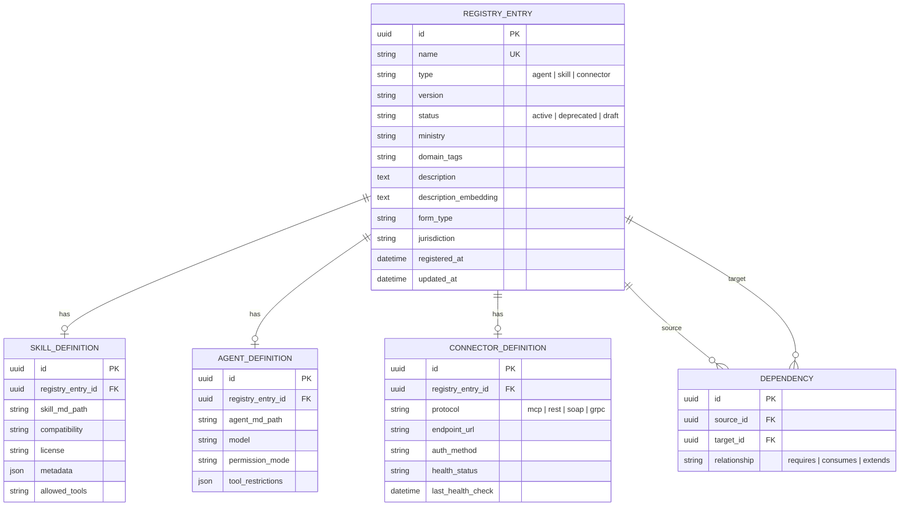
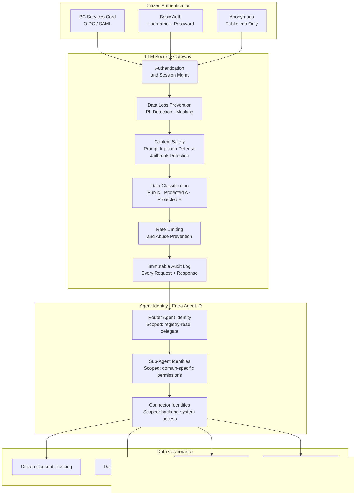
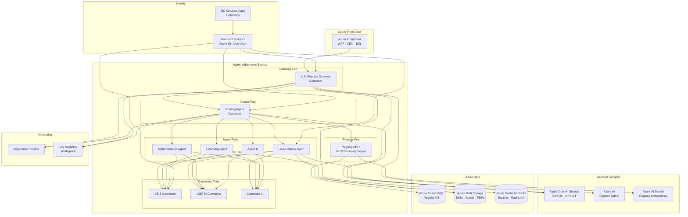
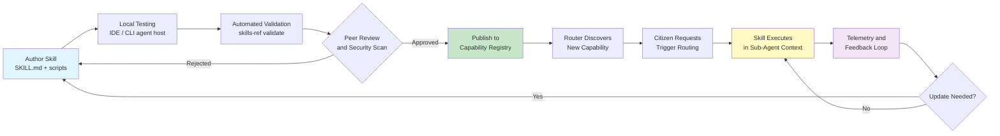
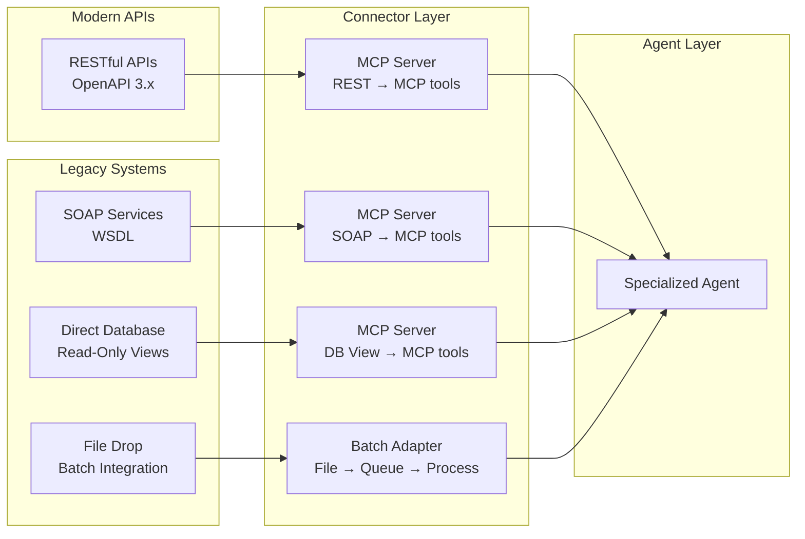
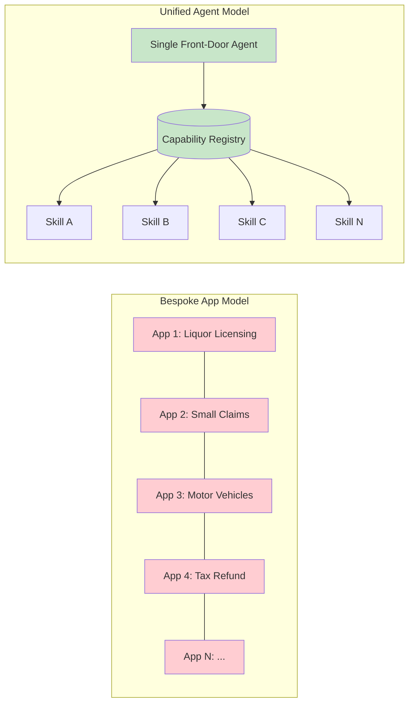
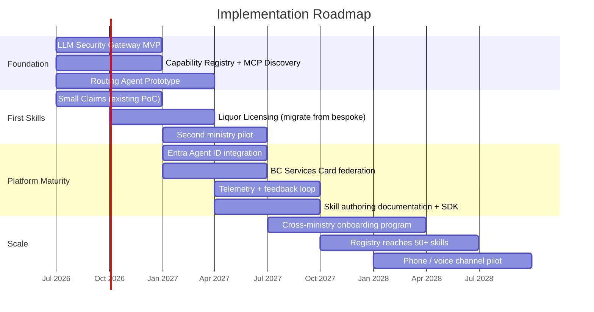

# BC Government Unified AI Assistant — Technical Architecture
## Industry-Aligned Reference Architecture for a Front-Door Agent Platform

**Author:** Richard Fremmerlid, Business Architect  
**Date:** 2026-06-15  
**Status:** Architecture Proposal — Draft  
**Companion Document:** `bc-gov-ai-assistant-vision.md`

---

## 1. Architecture Overview

The architecture follows a **layered, multi-agent orchestration pattern** — the dominant industry direction validated by Anthropic, Microsoft, Google DeepMind, and leading enterprise AI deployments. The citizen interacts with a single front-door agent. The system resolves intent, discovers capabilities from a registry, and delegates to specialized sub-agents that own domain workflows. That same pattern also applies to government knowledge brokerage. The router can classify the knowledge domain, then hand the request to the specialist agent that knows that content best.

### 1.1 High-Level Architecture

Figure 1. High-level architecture

### 1.2 Design Principles

| Principle | Implementation |
|-----------|---------------|
| **Single entry point** | One routing agent, one UI, one brand |
| **Separation of concerns** | Router routes; specialists specialize; registry indexes |
| **Open standards** | SKILL.md (agentskills.io), MCP, OpenAPI, OAuth 2.0 |
| **Portability over platform lock-in** | Skills are Markdown + scripts, not vendor-specific constructs |
| **Security by default** | Every request traverses the gateway; every agent has verifiable identity |
| **Progressive disclosure** | Metadata → instructions → resources loaded only as needed |
| **Incremental adoption** | Ministries publish skills independently; registry grows organically |

---

## 2. Industry Patterns & Precedents

This architecture synthesizes five converging industry patterns:

### 2.1 Multi-Agent Orchestration

**Source:** Anthropic Engineering ("How We Built Our Multi-Agent Research System"), Microsoft AutoGen, LangGraph, CrewAI

The industry consensus is that **a team of specialized agents dramatically outperforms a single generalist model**. The orchestrator (router) decomposes user intent and delegates to domain experts, each with focused system prompts, restricted tool access, and bounded context.

### 2.2 Model Context Protocol (MCP)

**Source:** Anthropic (creator), adopted by OpenAI, Google, and the broader ecosystem

MCP provides the **open-standard "nervous system"** for agent-to-tool and agent-to-agent communication. It defines a universal protocol for capability discovery, invocation, and data exchange — exactly the plug-and-play interoperability needed for a growing registry of government skills.

### 2.3 LLM Gateway / Proxy Pattern

**Source:** Azure AI Content Safety, AWS Bedrock Guardrails, LiteLLM Proxy, Portkey AI Gateway

The **LLM gateway** pattern places a programmable proxy between all clients and LLM backends. This single chokepoint enforces DLP rules, content filtering, rate limiting, model routing, cost tracking, and audit logging. It is now standard practice in regulated enterprise deployments.

### 2.4 Agent Identity & Zero Trust

**Source:** Microsoft Entra Agent ID, OAuth 2.0 Client Credentials for machine identities

Every agent in the system — the router, each specialized sub-agent, each connector — is treated as a **first-class identity** with verifiable credentials, scoped permissions, and auditable actions. This extends zero-trust principles from human users to autonomous agents.

### 2.5 Registry / Discovery Pattern

**Source:** Kubernetes Service Discovery, API Gateway registries (Kong, Apigee), npm/PyPI package registries

A **searchable capability registry** decouples the router from the capabilities it delegates to. New skills are published to the registry; the router discovers them at runtime. This is the same pattern that makes microservice architectures and package ecosystems scale.

### 2.6 Knowledge Brokerage Pattern

**Source:** Anthropic Engineering, [How We Built Our Multi-Agent Research System](https://www.anthropic.com/engineering/multi-agent-research-system)

The router is not just a form launcher. It is also a knowledge router. It should identify the topic first, then route the request to the specialist agent that can search the best source of truth for that topic. Depending on the domain, that search may use indexed content, RAG, semantic search, recursive search, or a deeper multi-step research loop.

This is the same basic idea behind mixture-of-experts systems. One controller decides which expert should handle the request, then the expert does the actual work.

### 2.7 Agent Registry / Marketplace Pattern

**Source:** 21st.dev, [Introducing the Agent Registry: Share and Discover Anthropic Managed Agent Templates](https://21st.dev/community/blog/agent-registry)

Agent definitions should be treated as reusable artifacts, not one-off prompt blobs. A registry gives the platform a way to publish, discover, and copy tested configurations, including the model choice, system prompt, and MCP server bundle. That makes good government agents easier to reuse across ministries.

### 2.8 Intent-First Agentic Apps

**Source:** Microsoft, [From apps to agents: Rearchitecting enterprise work around intent](https://www.microsoft.com/en-us/power-platform/blog/2026/03/12/from-apps-to-agents-rearchitecting-enterprise-work-around-intent/)

Microsoft describes the same architectural shift from another angle. Users state intent. Agents orchestrate the work. Apps remain trusted services and systems of record instead of the primary navigation surface. That is the right framing for BC Gov too.

### 2.9 Intelligence Layer / Frontier Transformation

**Source:** Microsoft, [A New Way of Working Is Taking Shape: Frontier Transformation](https://www.microsoft.com/en-us/dynamics-365/blog/business-leader/2026/03/09/a-new-way-of-working-is-taking-shape-frontier-transformation/)

Microsoft adds the missing middle layer here. The interface becomes an assistant, agents orchestrate workflows, and an intelligence layer consolidates structured and unstructured information so the right context is available when the agent acts. That maps cleanly to government knowledge brokerage and to the need for a shared context layer across services.

### 2.10 Platform Consolidation / Governance Layer

**Source:** Efficiently Connected, [Microsoft Build 2026: AI Platform, MAI Models, and Enterprise Governance](https://www.efficientlyconnected.com/microsoft-build-2026-developer-ai-platform-analysis/)

Build 2026 reinforces the same direction at the platform level. Shared context, a control plane for agents, and governance baked into the execution environment make agent systems easier to operate at scale. For BC Gov, this is the case for a managed front door, not a loose collection of one-off assistants.

### 2.11 Front Door / Execution Layer

**Source:** Workday Engineering, [The AI Front Door Is Already Here](https://medium.com/workday-engineering/the-ai-front-door-is-already-here-its-becoming-the-enterprise-execution-layer-105c067ca081)

Workday makes the execution case explicit. The front door should handle both knowledge and execution, and each specialist agent should carry a durable identity that defines its truth standards, boundaries, and escalation behavior. That lines up with the repo’s SKILL.md-first approach.

---

## 3. Core Components

### 3.1 Component Architecture

Figure 2. Component architecture

### 3.2 Component Responsibilities

#### Front-Door Routing Agent
- Receives citizen input after gateway processing
- Classifies intent using few-shot prompting and registry metadata
- Searches the capability registry for matching agents/skills
- Delegates to the best-matched sub-agent with a focused task prompt
- Synthesizes sub-agent results for citizen-facing response
- Does **not** attempt domain-specific work itself

#### Capability Registry
- Stores metadata for all registered agents, skills, and connectors
- Indexed by: name, description keywords, form type, ministry, jurisdiction, domain tags
- Supports semantic search (embedding-based) and structured filtering
- Versioned entries — skills can be updated without breaking routing
- Publishes health/status for active connectors

#### Specialized Sub-Agents
- Each owns a bounded domain (e.g., Small Claims, Liquor Licensing, Motor Vehicles)
- Defined as agent Markdown files with system prompts, tool restrictions, and model config
- Consume one or more skills for specific workflows within their domain
- Operate in isolated context windows (no cross-agent context leakage)

#### Skills (SKILL.md)
- The atomic unit of capability — portable, version-controlled, open-standard
- Each skill defines: metadata, step-by-step instructions, scripts, references, assets
- JSON-driven question sets where AI is only needed for clarification
- Consumed by sub-agents, IDE tools, web apps, or future phone agents interchangeably

#### Connectors (MCP Servers / API Adapters)
- Bridge between skills and backend government systems
- MCP servers for systems that benefit from standardized tool discovery
- REST/SOAP adapters for existing API contracts
- Each connector is an independently deployable, identity-verified service

---

## 4. Request Lifecycle

Figure 3. Request lifecycle

---

## 5. Skill & Agent Registry

### 5.1 Registry Data Model

Figure 4. Registry data model

### 5.2 Discovery Mechanism

The routing agent queries the registry using a two-stage search:

1. **Semantic search** — Citizen intent is embedded and compared against `description_embedding` vectors using cosine similarity. Returns top-K candidate capabilities.
2. **Structured filter** — Results are narrowed by `jurisdiction`, `form_type`, `status`, `domain_tags` to ensure relevance and eligibility.

#### MCP vs. Direct Database Access

| Approach | Pros | Cons | Recommendation |
|----------|------|------|----------------|
| **MCP Server fronting the registry** | Standard discovery protocol; sub-agents and external tools can also query; future-proof | Additional service to deploy and maintain; MCP spec still maturing | **Recommended for production** — aligns with open standards and enables external consumers |
| **Direct database queries** | Simpler initial implementation; lower latency | Tightly couples router to registry internals; not discoverable by other agents | Acceptable for **MVP/prototype** phase |
| **Hybrid** | Registry DB for writes and admin; MCP server as read-only discovery facade | Two interfaces to maintain | Best of both — **recommended long-term target** |

---

## 6. Security Architecture

### 6.1 Security Layers

Figure 5. Security layers

### 6.2 Security Principles

| Principle | Implementation |
|-----------|---------------|
| **Zero trust for agents** | Every agent (router, sub-agent, connector) authenticates via Entra Agent ID with least-privilege scoped tokens |
| **No direct LLM access** | All LLM calls pass through the gateway — no agent bypasses the security layer |
| **PII never in prompts** | DLP engine detects and masks PII before it reaches any LLM; references are tokenized |
| **Data classification enforcement** | Protected B data never leaves its ministry boundary without explicit policy; the router handles cross-ministry requests by delegating, not aggregating |
| **Audit everything** | Immutable log of every citizen interaction, agent delegation, tool invocation, and backend call |
| **Prompt injection defense** | Input sanitization, system prompt isolation, and output validation at the gateway |

---

## 7. Deployment Architecture

### 7.1 Azure-Based Deployment (BC Gov Context)

Figure 6. Azure-based deployment

### 7.2 Scaling Model

| Component | Scaling Strategy |
|-----------|-----------------|
| **Gateway** | Horizontal pod autoscaler — scales with request volume |
| **Router** | Horizontal — stateless intent classification |
| **Sub-Agents** | Per-agent scaling based on domain demand (e.g., tax season → scale Revenue agent) |
| **Registry** | Read replicas; cache-heavy; low write volume |
| **Connectors** | Independent scaling per backend system capacity |
| **LLM Backends** | Azure OpenAI provisioned throughput units (PTUs) for predictable workloads; pay-per-token for burst |

---

## 8. Skill Lifecycle

How a new capability goes from idea to production:

Figure 7. Skill lifecycle

### 8.1 Lifecycle Stages

| Stage | Description | Tooling |
|-------|-------------|---------|
| **Author** | Developer writes `SKILL.md`, scripts, references, assets following agentskills.io spec | Any text editor / IDE with agent skill support |
| **Test locally** | Skill is consumed by a local agent host (Claude Code, GitHub Copilot, etc.) with no UI dependency | Agent host CLI; conversational Q&A against the skill |
| **Validate** | Automated checks: frontmatter schema, naming conventions, script syntax, eval assertions | `skills-ref validate`, CI pipeline |
| **Review** | Peer review of skill logic, security scan of scripts, legal review of domain content if applicable | Pull request workflow; SAST/DAST scanning |
| **Publish** | Skill metadata and artifacts are written to the capability registry | Registry CLI or CI/CD publish step |
| **Discover** | Router finds the skill via semantic + structured search when citizen intent matches | Real-time registry query |
| **Execute** | Skill runs inside a sub-agent's isolated context with restricted tools and scoped permissions | AKS pod; sandboxed execution environment |
| **Monitor** | Telemetry on usage, success rate, latency, citizen satisfaction, error rate | Application Insights; feedback API |
| **Iterate** | Skill is updated based on telemetry and feedback; new version published to registry | Version bump; registry update |

---

## 9. Integration Patterns

### 9.1 Connecting Existing BC Gov Systems

Figure 8. Connecting existing BC Gov systems

### 9.2 Integration Strategies by System Type

| Backend System | Current State | Connector Strategy |
|----------------|---------------|-------------------|
| **CEIS** (Court Electronic Information System) | Legacy; limited API surface | Read-only DB views exposed via MCP server; write operations via existing filing APIs or queued file drops |
| **JUSTIN** (Justice Information System) | Mainframe-backed; SOAP interfaces | SOAP-to-MCP bridge adapter; field mapping maintained in connector config |
| **ICM** (Integrated Case Management) | Dynamics-based; REST APIs available | Direct REST → MCP server; leverage existing Dynamics Web API |
| **LTSA** (Land Title & Survey Authority) | Modern APIs in progress | REST → MCP server; OpenAPI spec as source of truth |
| **PARIS** (Revenue system) | Mixed; some REST, some batch | Hybrid: REST for real-time queries; batch adapter for reconciliation |
| **New systems** | Greenfield | Build MCP-native from day one; publish tools to registry alongside system deployment |

---

## 10. Scalability & Evolution

### 10.1 Onboarding New Ministries

The architecture supports **incremental adoption** without big-bang migration:

1. **Ministry authors skills** — Using SKILL.md spec, tested locally in IDE with no infrastructure dependency
2. **Ministry publishes to registry** — Skills appear in the registry with ministry, domain, and jurisdiction tags
3. **Router discovers automatically** — No router code changes required; new capabilities are found via registry search
4. **Connectors deployed independently** — Each ministry's backend connector is an independent service with its own identity and scaling
5. **Rollback is trivial** — Set registry entry status to `deprecated`; router stops routing to it

### 10.2 Technology Evolution Resilience

| Shift | Impact on Architecture |
|-------|----------------------|
| **New LLM models** | Swap model config in gateway or agent definition; skills and data contracts unchanged |
| **New agent protocols** | Add protocol adapter alongside MCP; registry tracks connector protocol type |
| **Phone-native agents** | Phone consumes skills directly from registry or via thin API layer; no new skills needed |
| **Voice interfaces** | New presentation layer connects to same gateway; orchestration layer unchanged |
| **Regulatory changes** | Update gateway DLP/content rules; no agent or skill changes required |
| **Deprecation of web apps** | Skills and registry survive; only presentation layer is retired |

---

## 11. Technology Recommendations

### 11.1 Recommended Stack (BC Gov Azure Environment)

| Layer | Technology | Rationale |
|-------|-----------|-----------|
| **Presentation** | Next.js + `@bcgov/design-system-react-components` | Proven in PoC; BC Gov standard |
| **Gateway** | Custom Python/Go service on AKS + Azure AI Content Safety | Full control over DLP rules; Content Safety for prompt injection defense |
| **Routing Agent** | LangGraph (Python) on AKS | Industry-standard orchestration framework; supports multi-agent delegation natively |
| **LLM Backend** | Azure OpenAI Service (GPT-4.1, GPT-4o) | BC Gov Azure tenant; provisioned throughput available; Entra ID integrated |
| **Registry DB** | Azure Database for PostgreSQL Flexible Server + pgvector | Relational + vector search in one store; semantic search over skill descriptions |
| **Registry Discovery** | MCP server (TypeScript/Python) on AKS | Open-standard discovery; consumable by router, sub-agents, and external tools |
| **Skill Storage** | Azure Blob Storage + Git (GitHub/Azure DevOps) | Git for version control and PR review; Blob for runtime artifact access |
| **Agent Identity** | Microsoft Entra ID + Entra Agent ID | Native to Azure; zero-trust agent authentication; scoped permissions |
| **Citizen Identity** | BC Services Card (OIDC federation via Entra ID) | Existing BC Gov citizen identity standard |
| **Session & Cache** | Azure Cache for Redis | Session state, rate limiting, token caching |
| **Monitoring** | Application Insights + Log Analytics | Native Azure observability; custom dashboards for agent telemetry |
| **CI/CD** | GitHub Actions or Azure DevOps Pipelines | Skill validation, security scanning, registry publish automation |
| **Container Orchestration** | Azure Kubernetes Service (AKS) | BC Gov standard for containerized workloads; per-agent pod scaling |

---

## 12. Comparison to Alternatives

### 12.1 Why Not Bespoke Apps?

Figure 9. Bespoke app model versus unified agent model

| Dimension | Bespoke Apps (1,000+) | Unified Agent (1 + Registry) |
|-----------|----------------------|------------------------------|
| **Apps to maintain** | 1,000+ | 1 |
| **UIs to design** | 1,000+ | 1 |
| **Discoverability** | Citizen searches across dozens of sites | Citizen states intent; system finds capability |
| **Consistency** | Each team makes different choices | One design system, one interaction pattern |
| **Cost to add capability** | Build new app ($100K–$500K+) | Author new skill ($1K–$10K) |
| **Time to add capability** | Months | Days to weeks |
| **Portability** | Locked to app stack | Skill runs anywhere agents run |
| **Technology resilience** | Rewrite each app when paradigm shifts | Swap presentation layer; skills survive |

### 12.2 Why Not a Monolithic AI?

A single monolithic LLM that "knows everything" about government:

| Risk | Mitigation via Multi-Agent |
|------|--------------------------|
| **Context window exhaustion** | Each sub-agent works in its own context; only relevant information is loaded |
| **Hallucination across domains** | Sub-agents have focused system prompts and restricted tool access; less room to confabulate |
| **Permission sprawl** | Each agent has scoped identity and least-privilege access; the router cannot access backend systems directly |
| **Unauditable decisions** | Delegation creates a clear trace: router → agent → skill → tool → backend |
| **Single point of failure** | Sub-agents are independent; one failing domain doesn't bring down others |
| **Update risk** | Skills are independently versioned; updating tax logic doesn't risk breaking motor vehicles |

---

## 13. Roadmap Phases

Figure 10. Implementation roadmap

---

## References

1. Anthropic. "How We Built Our Multi-Agent Research System." Anthropic Engineering Blog, 2025.
2. Anthropic. "Introducing the Model Context Protocol." Anthropic News, 2025.
3. Microsoft. "Announcing Microsoft Entra Agent ID." Microsoft Tech Community, 2025.
4. Agent Skills Specification. [agentskills.io/specification](https://agentskills.io/specification)
5. LangChain. "LangGraph: Multi-Agent Orchestration." LangChain Docs.
6. IBM. "LLM Agent Orchestration: A Step by Step Guide." IBM Think Tutorials.
7. Azure. "Azure AI Content Safety." Microsoft Azure Documentation.
8. Fremmerlid, R. "The End of Government Forms: A Vision for an AI-Powered Public Service." Medium, 2025.
9. Fremmerlid, R. "Architecting the Future: A Technical Blueprint for a Unified Government AI Agent." Medium, 2025.
10. Deloitte. "AI Use Cases in Government." Deloitte US.
11. Harvard Kennedy School. "AI for the People: Use Cases for Government." M-RCBG Working Paper, 2024.
